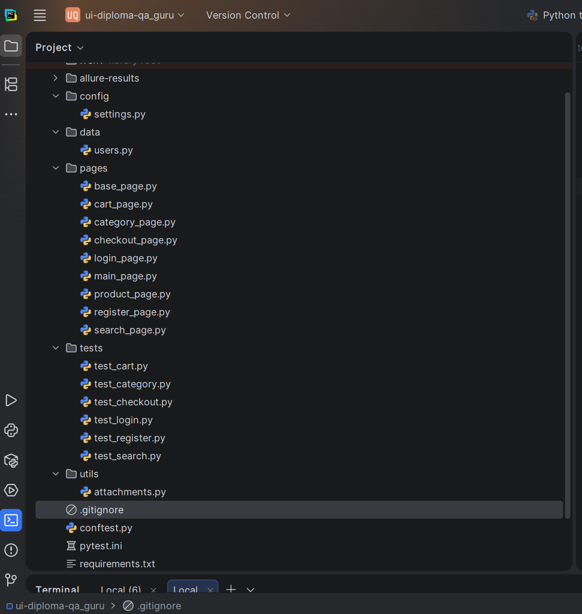

🚀 UI Automation Diploma Project | Demo Web Shop

Automated UI testing project developed as part of the QA.GURU Diploma Program.

The project demonstrates a complete UI test automation framework built using modern testing tools and design patterns.

📌 Project Overview

This project automates key business scenarios of the Demo Web Shop application:

- User registration
- Authentication
- Product search
- Shopping cart management
- Product catalog navigation
- End-to-end checkout flow

The framework follows the Page Object Pattern, provides detailed Allure Reports, and uses dynamically generated test data.

## 🛠 Tech Stack

| Technology | Purpose |
|------------|----------|
| Python 3.12 | Programming language |
| Pytest | Test runner |
| Selene | UI testing framework |
| Selenium WebDriver | Browser automation |
| Allure Report | Reporting |
| Faker | Test data generation |
| GitHub | Version control |
| Jenkins | CI/CD |

## 🏗 Project Architecture

```text
ui-diploma-qa_guru

├── tests
│   ├── test_login.py
│   ├── test_register.py
│   ├── test_search.py
│   ├── test_cart.py
│   ├── test_category.py
│   └── test_checkout.py

├── pages
│   ├── base_page.py
│   ├── login_page.py
│   ├── register_page.py
│   ├── cart_page.py
│   ├── category_page.py
│   └── checkout_page.py

├── data
│   └── users.py

├── config
├── utils

├── requirements.txt
├── pytest.ini
└── README.md
```


🎯 Implemented Test Scenarios
Authentication

✅ Successful Login

✅ Unsuccessful Login

✅ Logout

Registration

✅ Successful Registration

Search

✅ Search Existing Product

✅ Search Non Existing Product

Shopping Cart

✅ Add Product To Cart

✅ Remove Product From Cart

Product Catalog

✅ Open Computers Category

✅ Open Desktops Category

✅ Open Product Card

Checkout

✅ New Registered User Can Complete Checkout

✨ Framework Features
Page Object Pattern
Base Page abstraction
Dynamic test data generation
Allure Steps
Fluent API style
Reusable page components
Independent test execution
End-to-End checkout scenario

📊 Test Results

Current project status:

12 Passed
0 Failed
▶ Running Tests

Run all tests:

pytest tests -v

Run a specific test:

pytest tests/test_checkout.py -v
📈 Allure Report

Generate results:

pytest tests --alluredir=allure-results

Open report:

allure serve allure-results
## 📸 Reporting Examples

### 🏗 Project Structure



The project follows the Page Object Model (POM) pattern and contains separate layers for tests, pages, configuration and utilities.

---

### 📊 Allure Report Overview


General information about test execution, statistics, duration and test status distribution.

---

### 📂 Allure Suites


Grouping of automated tests by suites and business functionality.

---

### 🛒 Checkout E2E Scenario


Detailed execution of the end-to-end checkout scenario with steps and assertions.

---

### ⚙️ Jenkins Build

*Add Jenkins build screenshot here if available.*
Allure Overview
Allure Suites
Checkout E2E Scenario
Jenkins Build

## 👨‍💻 Author

> **Leonid Chaliy**  
> QA Automation Engineer  
>
> 🐙 GitHub: https://github.com/LumisVal  
> 📱 Mobile Automation • 🌐 UI Automation • 🔌 API Testing

<<<<<<< HEAD
📌 Diploma Project
=======
QA.GURU Diploma Project
>>>>>>> origin/master
